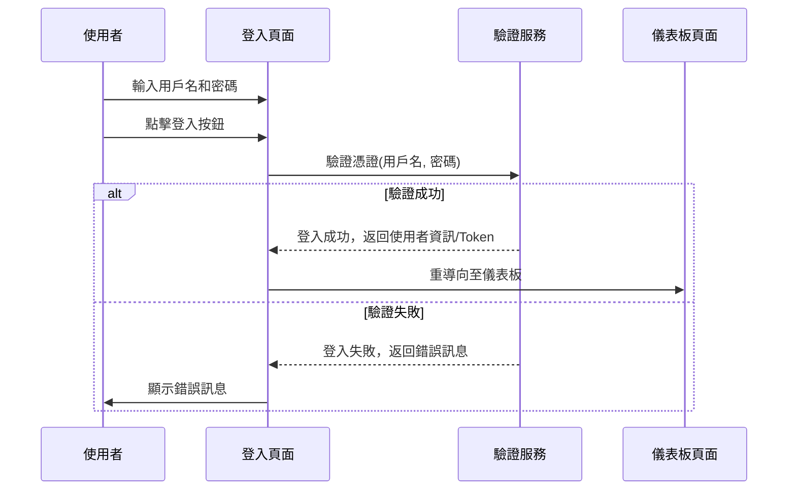
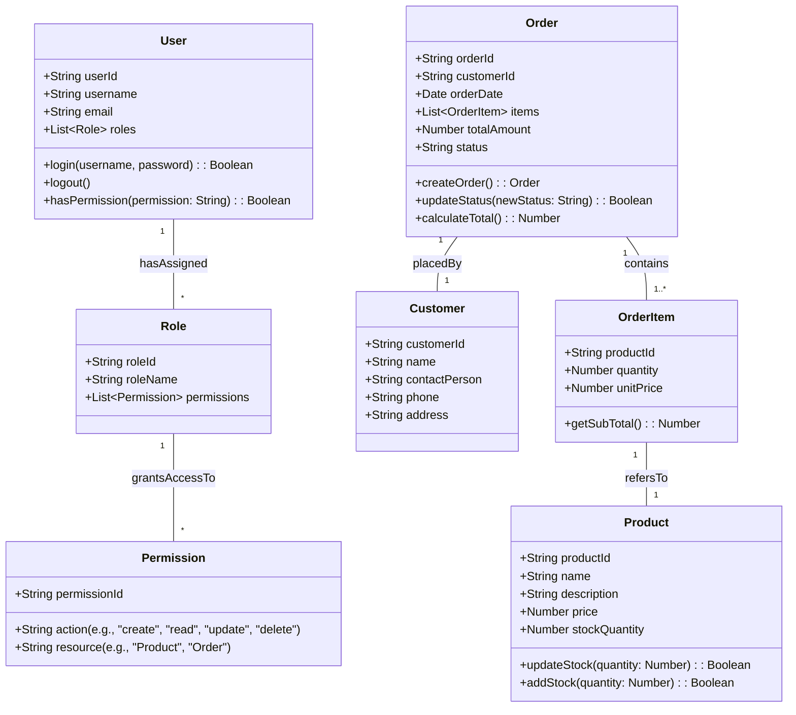
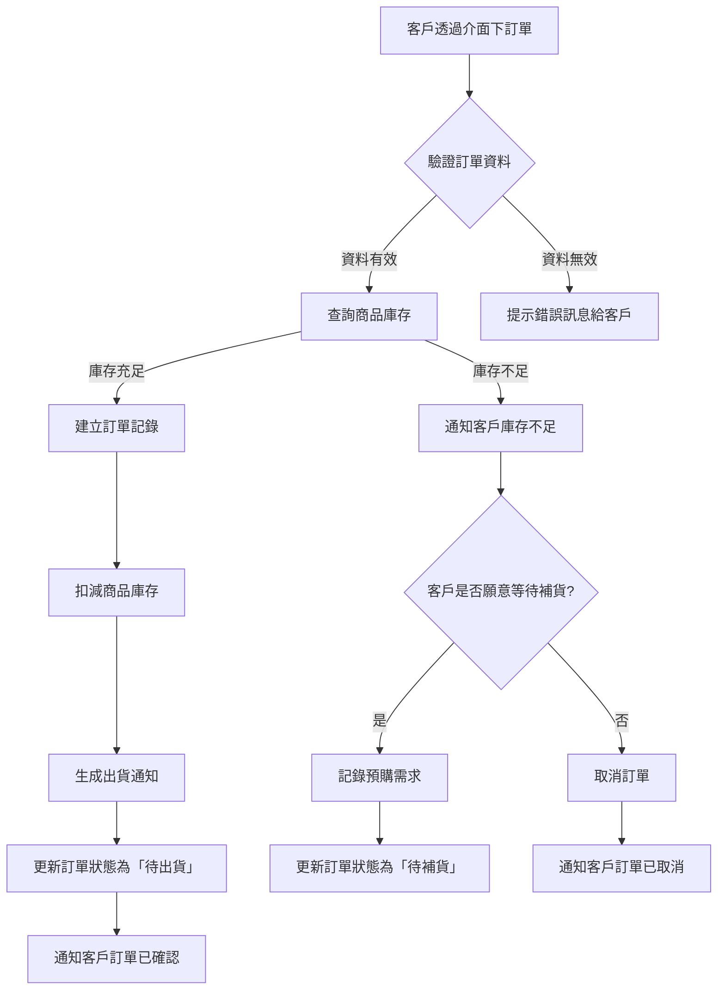

# 專案規格

此檔案旨在存放**您的**專案規格。您可以使用 RefactorFlow 應用程式來編輯它。

## 專案概述

ERP Central 是一個現代化的企業資源規劃 (ERP) 系統原型，旨在提供一套整合的解決方案來管理中小型企業的核心業務流程。系統將涵蓋基礎資料管理、進銷存、以及可能的 AI 輔助功能。

## 核心功能模組

- **使用者驗證與權限管理**：
  - 使用者應能夠使用用戶名和密碼註冊及登入。
  - 系統應支援角色型權限控制 (RBAC)。
  - 應能管理使用者帳號、角色和權限分配。
- **儀表板 (Dashboard)**：
  - 登入後顯示系統概覽、關鍵指標和常用功能入口。
  - 應包含公司公告或通知區塊。
- **系統設定模組**：
  - 系統參數設定。
  - 系統代碼管理 (例如：產品類別、客戶等級)。
  - 資料庫備份與還原介面 (概念性)。
- **基本資料管理**：
  - 客戶資料管理。
  - 廠商資料管理。
  - 品號 (商品/物料) 資料管理。
- **進貨系統** (概念性，可逐步完善)：
  - 採購單管理。
  - 進貨單管理。
- **銷貨系統** (概念性，可逐步完善)：
  - 銷售訂單管理。
  - 銷貨單管理。
- **庫存系統** (概念性，可逐步完善)：
  - 庫存查詢。
  - 調撥作業。
- **(可選) AI 輔助功能**：
  - 例如：根據歷史銷售數據預測需求 (Genkit)。
  - 文件內容同步建議 (如 `suggest-updates.ts` 所示範)。

## 技術需求與架構

- **後端框架**: Next.js (App Router, Server Actions, API Routes if needed)
- **前端框架**: Next.js (React - Functional Components, Hooks)
- **UI 元件庫**: ShadCN UI
- **樣式**: Tailwind CSS
- **AI 整合**: Genkit (Google AI - Gemini)
- **資料庫**: (未指定，原型階段可使用模擬數據或輕量級資料庫方案)
- **語言**: TypeScript

## 詳細系統設計 (UML 圖表)

本章節包含用於描述系統架構和行為的 UML 圖表。這裡提供的圖表是初步範例，應針對各個具體模組進行詳細設計和擴展。

圖表使用 [Mermaid](https://mermaid.js.org/) 語法繪製。

### 模組循序圖 (Sequence Diagrams)

循序圖用於展示物件之間如何依照時間順序進行互動。以下為一個用戶登入模組的範例：



*TODO: 為 ERP Central 的核心模組 (如庫存管理、訂單處理、客戶關係等) 創建詳細的循序圖。*

### 系統類別圖 (Class Diagram)

類別圖用於描述系統的靜態結構，包括類別、屬性和它們之間的關係。以下為一個簡化的系統核心類別範例：



*TODO: 擴展此類別圖以包含 ERP Central 系統的所有主要實體和它們之間的關係，例如廠商 (Vendor)、採購單 (PurchaseOrder) 等。*

### 業務流程圖 (Business Process Flow)

業務流程圖（此處使用流程圖示意）用於說明關鍵業務操作的步驟。以下為一個簡化的訂單處理流程範例：



*TODO: 為 ERP Central 的核心業務流程 (如採購流程、庫存入庫流程、退貨流程等) 創建詳細的流程圖。*

### 實體關聯圖 (ERD - Conceptual)

實體關聯圖用於展示資料庫中不同實體（資料表）之間的關係。詳細的 ERD 應包含主鍵 (PK)、外鍵 (FK) 和基數等資訊。此處的類別圖可作為概念 ERD 的基礎。

*TODO: 創建一個詳細的資料庫 ERD，明確標示所有資料表、欄位、資料型態、主鍵、外鍵以及它們之間的關係和基數。*

## 非功能性需求

- **效能**: 頁面載入時間應在可接受範圍內 (例如，主要頁面 3 秒內)。
- **安全性**: 保護使用者資料，防止常見的 Web 漏洞 (如 XSS, CSRF)。
- **可擴展性**: 系統架構應易於擴展以支援更多模組和使用者。
- **易用性**: 使用者介面應直觀易用。
- **可靠性**: 系統應穩定運行，減少錯誤和崩潰。

使用 RefactorFlow 中的 AI 建議功能，以保持此文件與您的 README 和待辦事項清單同步。
```